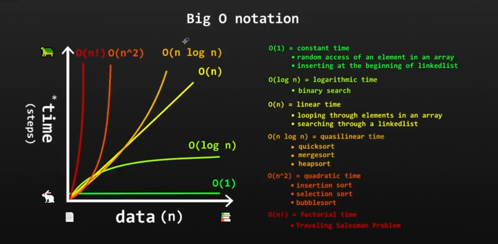

# Data structure & Algorithms in C#

C# Data structure and algorithm basic/advanced topics practice and documentation. As a software engineer, it's imperative that you learn and master DSA. It will enable you to write clean and efficient code, not only that, but it will also help you ace coding interviews since most questions asked are based on DSA.

## Table of Content

1. [What is a data structure?](#what-is-a-data-structure)
2. [Stacks](#stacks)
3. [Queues](#queues)
4. [Priority queues](#priority-queues)
5. [LinkedLists](#linkedlists)
6. [Dynamic Arrays](#dynamic-arrays)
7. [Big O Notation](#big-o-notation)
8. [Algorithms](#algorithms)
9. [Search Algorithms](#search-algorithms)
10. [Linear Search](#linear-search)
11. [Binary Search](#binary-search)
12. [Interpolation Search](#interpolation-search)

----------------------------------------------------------------------------------------------------

# What is a data structure?

A data structure is a format and named location that can be used to store, process, retrieve and organize data. Below are the basic of data structures in CS (Computer Science): 👇

## Stacks

Stacks is a LIFO (Last-in First-out) data structure that stores objects (passed in values) vertically. Example: 👇

```csharp
Stack<string> cars = new Stack<string>();
            
cars.Push("Corolla");
cars.Push("Tacoma");
cars.Push("Silverado");
cars.Push("Tesla");
```
**Common stacks method: 👇**

* .Push() => To push an item to the top of a stack
* .Peek() => To return the top item from a stack
* .Pop() => To remove item from the top of a stack
* .Contains() => To check whether an element exists in a stack
* .Clear() => To remove all items in a stack at once
* .Count() / .Length() => Return the number of items in a stack

## Queues

Queues is a FIFO (First-in First-out) data structure and collection of objects. Example: 👇

```csharp
 Queue<string> queues = new Queue<string>();
            
queues.Enqueue("Dave");
queues.Enqueue("Pete");
queues.Enqueue("James");
queues.Enqueue("Dapson");
```

**Common queues method: 👇**

* .Enqueue() => To add an item into the queue
* .Dequeue() => To remove an item from the beginning of the queue
* .Peek() => To return the beginning item from a queue
* .Contains() => To check whether an element exists in a queue
* .Clear() => To remove all items in a queue at once

## Priority queues

This is still a queue but with a twist, it doesn't work based on the FIFO rule. It will first serve/print items with high priority before printing an item with low priority. Example: 👇

```csharp
PriorityQueue<string, double> queues = new PriorityQueue<string,double>();

queues.Enqueue("Item One",2.7);
queues.Enqueue("Item Two",2.6);
queues.Enqueue("Item Three",3.5);
queues.Enqueue("Item Four",4.5);
queues.Enqueue("Item Five",1.9);

// Print all item & it's priority to the console with the `TryDequeue` method
while (queues.TryDequeue(out string? item, out double priority))
{
    Console.WriteLine($"{item} & it's Priority is: {priority}");
}
```

## LinkedLists

LinkedLists is a data structure that can handle dynamic data elements known as `node`. Each `node` consists of two fields; `1. data field`, `2. address field which will reference the next node`. The two types of LinkedList are: 👇

* Singly-linked list => Contains only an address which will reference the next nodes
* Doubly-linked list => Contains two addresses which will reference the prev and next nodes

Example of a doubly-linked list: 👇

```csharp
LinkedList<string> fruits = new LinkedList<string>();

fruits.AddLast("Mango");
fruits.AddLast("Orange");
fruits.AddLast("Watermelon");
fruits.AddFirst("Guava");

// Reverse the linked-list by calling the `.Reverse()` method
foreach (string fruit in fruits.Reverse())
{
    Console.WriteLine(fruit);
}
```

**Common LinkedLists method: 👇**

* .AddLast() => To add an element in a linked-list last position
* .AddFirst() => To add an element in a linked-list first position
* .Remove() => To remove a specified element from a linked-list
* .RemoveFirst() => To remove the first element from a linked-list
* .RemoveLast() => To remove the last element from a linked-list
* .Clear() => To clear the entire elements in a linked-list
* .Reverse() => To reverse the order of a linked-list

## Dynamic Arrays

Just as its name suggests, it's a dynamic and growable array that is not fixed which have advantages over static arrays. Example: 👇

```csharp
ArrayList games = new ArrayList();

games.Add("Call of Duty");
games.Add("Elden Ring");
games.Add("PUBG");
```

**Common Dynamic Arrays method: 👇**

* .Add() => To add an item
* .Insert() => To insert an item into the dynamic array at a specified index
* .Remove() => To remove a specified item from a dynamic array
* .RemoveRange() => To remove more than one item from a dynamic array using index
* .Count => To get the total number of item in a dynamic array
* .Clear() => To remove all items from a dynamic array at once
* .Sort() => To sort items in the array alphabetically or in ascending order

## Big O Notation

Big O notation is `how code slows as data grows`. It's used to detect how long an algorithm takes to run (time complexity) or how much memory is consumed by an algorithm (space complexity).

**Types of Big O run time: 👇**

* 0(1) => Constant time
* 0(log n) => Logarithmic time
* 0(n) => Linear time
* 0(n log n) => Quasilinear time
* 0(n^²) => Quadratic time
* 0(n!) => Factorial time

**Visual representation: 👇**



# Algorithms

Algorithms in CS is a set of rules to be followed for implementing a problem solving operations. Here are some of the useful algos to know and use.

## Search Algorithms

## Linear Search

Linear search is a simple search algorithms that will iterate through a collection of element one at a time to find a particular match that's passed in. It's a fast algorithm to implement with small to medium dataset `(<100)`. Example: 👇

```csharp
private static void Main()
{
    // Array of `int` to search through
    int[] nums = { 1, 2, 3, 4, 5, 6, 7, 8, 9 };
    int index = linearSearch(nums, 3);
    
    // Ternary operator to check whether the index matched with the value
    var confirm = index != -1 ? $"Element found at: {index}" : "Element not found!";
            
    Console.WriteLine(confirm);
}

// Linear search function expecting a parameter of array and integer value
private static int linearSearch(int[] nums, int value)
{
    // Iterating over the array and checking if it matched the value passed in
    for (int i = 0; i < nums.Length; i++)
    {
        if (nums[i] == value)
        {
            return i;
        }
    }

    return -1;
}
```

## Binary Search

Binary search is an algorithm used to finds the position of a given target value within a one dimensional sorted array. It's used to work with medium to large dataset as it will eliminate half of the array during each step. To implement the binary search algo is fairly simple in C#. Example: 👇

```csharp
// Initializing an array of type `int`
int[] numbers = {1, 2, 3, 4, 5, 6, 7, 8, 9, 10};
// The target we are trying to find
const int target = 7;
            
// Storing the `Array.BinarySearch` method in a variable
var index = Array.BinarySearch(numbers, target);
// Checking if our target is found or not using ternary operator
var foundOrNot = index == -11 ? $"{target} not found!" : $"Target found at {index}";
            
Console.WriteLine(foundOrNot);
```

## Interpolation Search

Interpolation search is an improved variant of binary search. Just that this algorithm only works on the probing position of the required value in a sorted array that are uniformly|evenly|equally distributed.

```csharp
private static void Main()
{
    int[] numbers = { 1, 2, 3, 4, 5, 6, 7, 8, 9 };
    int index = InterpolationSearch(numbers, 7);

    string probeValue = index != -1 ? $"Value found at index: {index}" : "Value not found!";
    Console.WriteLine(probeValue);
}

private static int InterpolationSearch(int[] numbers, int value)
{
    int hi = numbers.Length - 1;
    int lo = 0;

    while (value >= numbers[lo] && value <= numbers[hi] && lo <= hi)
    {
        int probe = lo + (hi - lo) * (value - numbers[lo]) / (numbers[hi] - numbers[lo]);
        Console.WriteLine($"Probe area: {probe}");

        if (numbers[probe] == value)
        {
            return probe;
        } else if (numbers[probe] < value)
        {
            lo = probe + 1;
        }
        else
        {
            hi = probe - 1;
        }
    }

    return -1;
}
```